# SportCamp

SportCamp for Android is a mobile application built in Kotlin. Practicing team sports requires finding enough friends available for playing one or
more matches: in today's frenetic life, this may be a challenge. So, one of the main capabilities offered by this court reservation application is a way to search for others
interested in playing in the time slots you or they have reserved.

# Description

After generating a new user profile, the app is launched displaying the calendar containing the field reservations. 
Now in the bottom bar four main sections can be seen:

- **Reservations**:
  This section displays the calendar of reservations. The "+" button allows you to make a new reservation by selecting the desired date and type of field. You can also choose to book playing equipment or publish     a game request to find other players in your city. Completed reservations appear in the calendar, and clicking on them allows you to view, modify, or cancel them.

- **Ratings**: In this section, users can rate the playing fields and leave comments. Clicking on the field's rating allows you to view all reviews from other users. Fields can also be filtered by sport.

- **Open matches**: This section offers two subsections:

    - *New Requests*: These are requests made by other players to which you can join by pressing "Accept Match!"
    - *Pending Reservations*: This section includes all reservations made by you or others that are not yet complete (missing players). Pending reservations are canceled 12 hours before the scheduled slot if all players are not found.
 
- **User profile**: Users can modify their profiles by adding their playing levels. This profile can be viewed by other users by clicking on the profile pictures.

## Screenshots

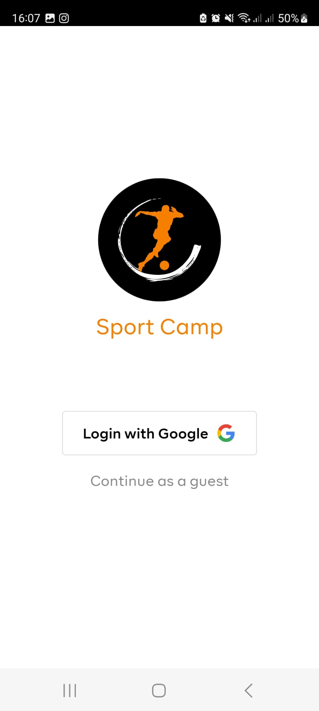

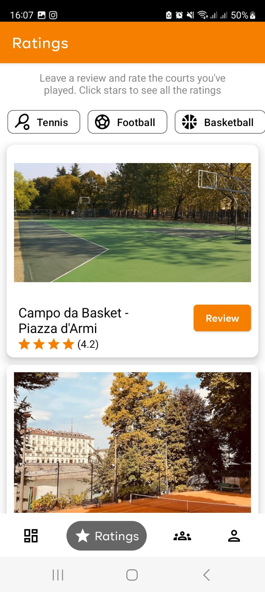
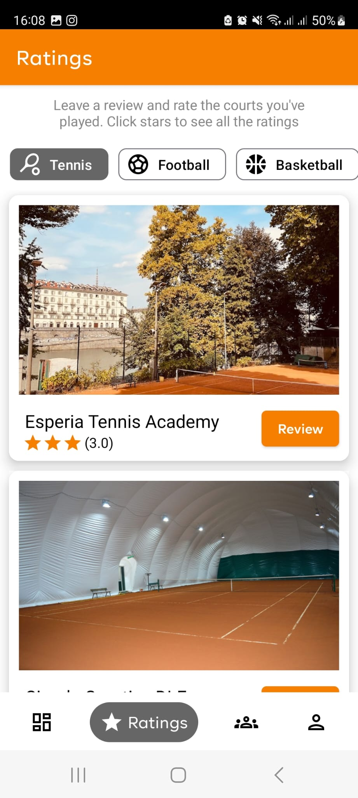
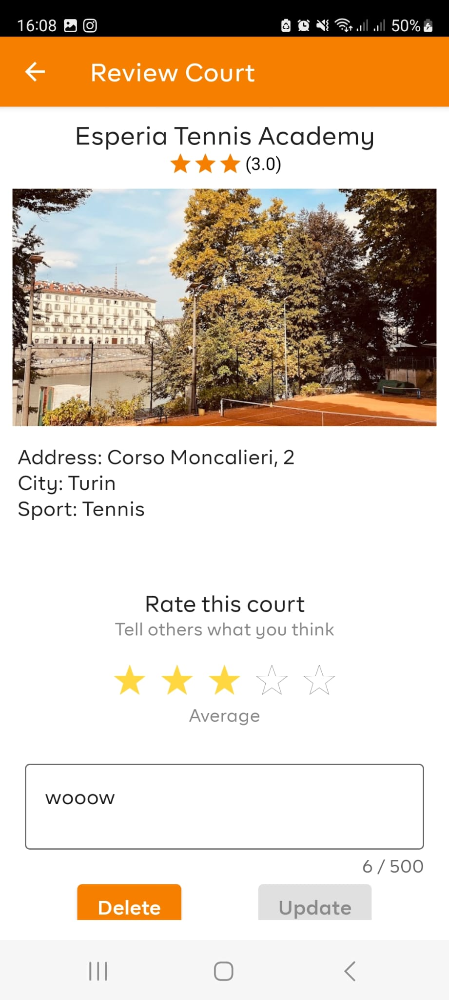
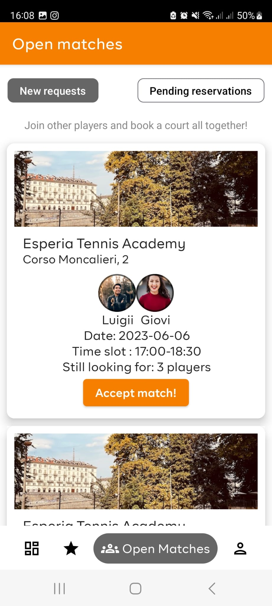
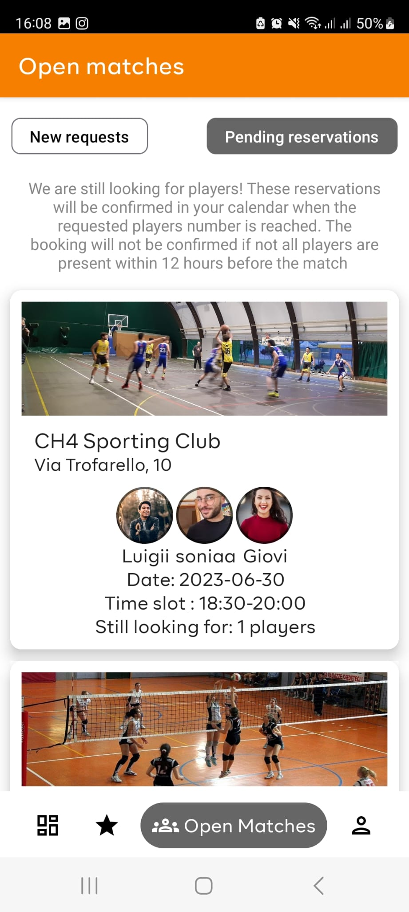
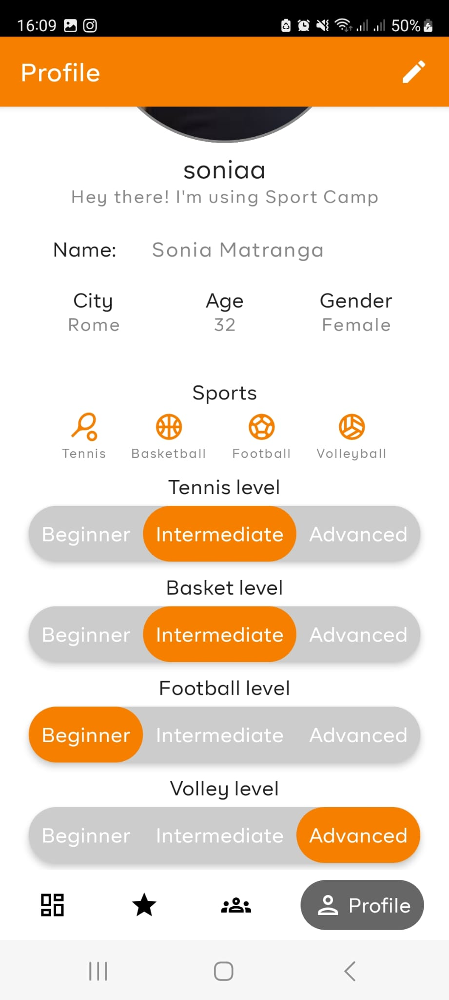
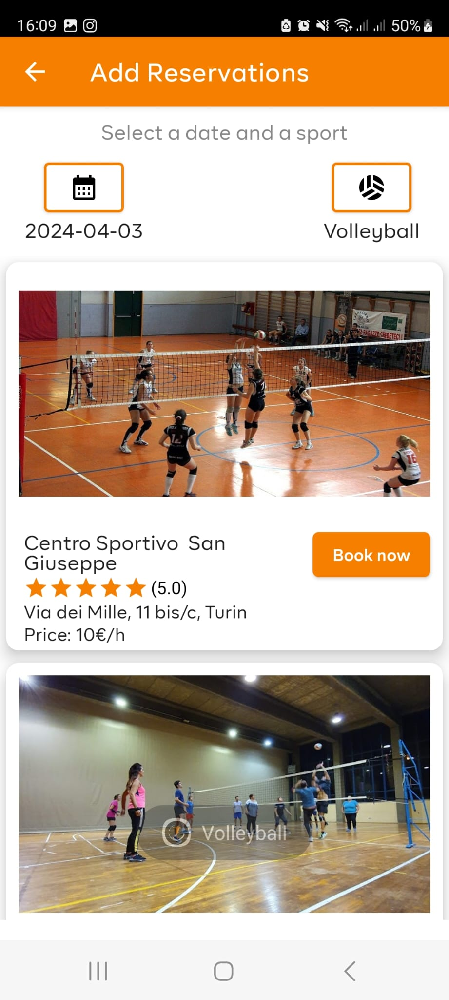
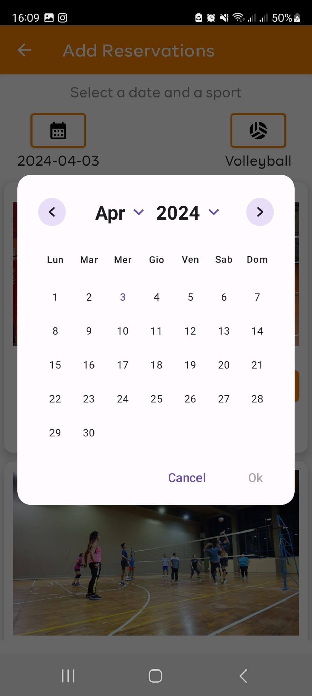
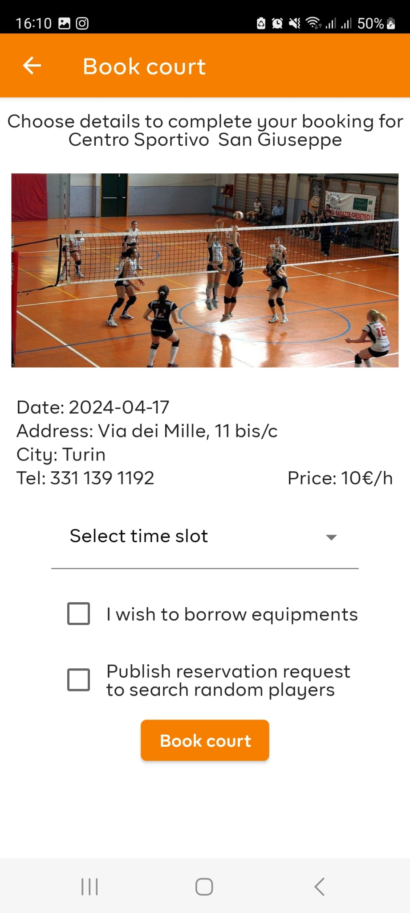
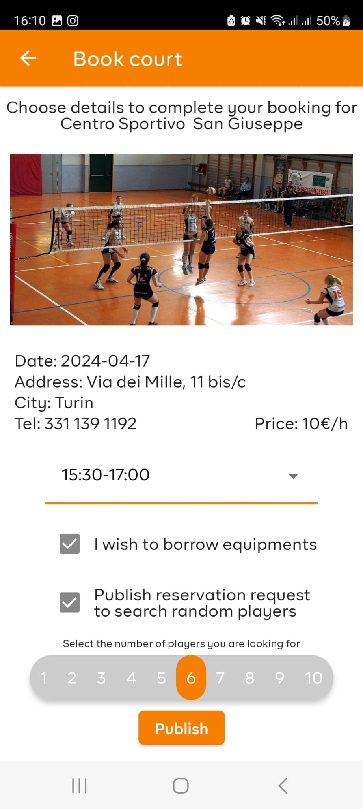
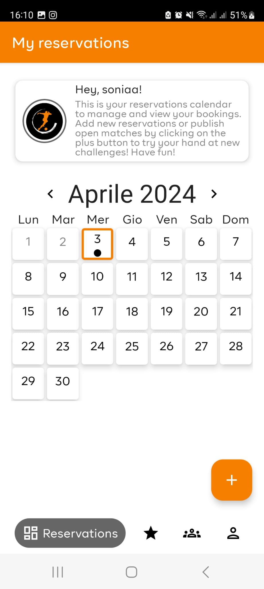
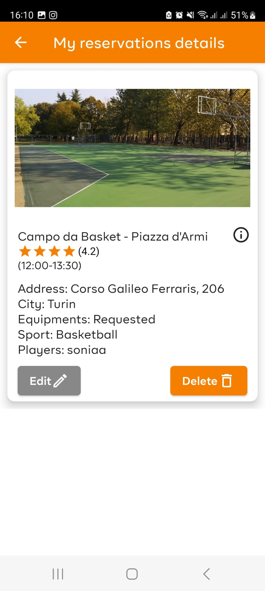
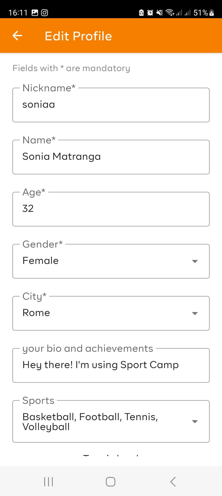
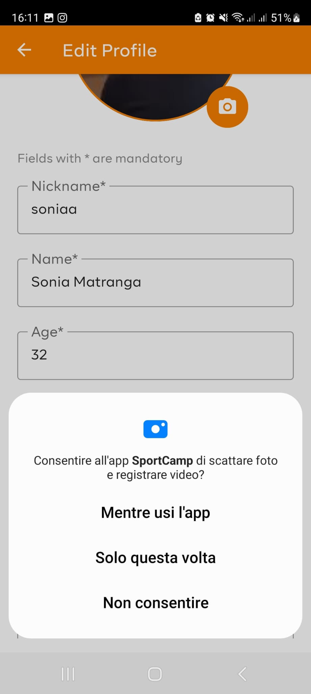
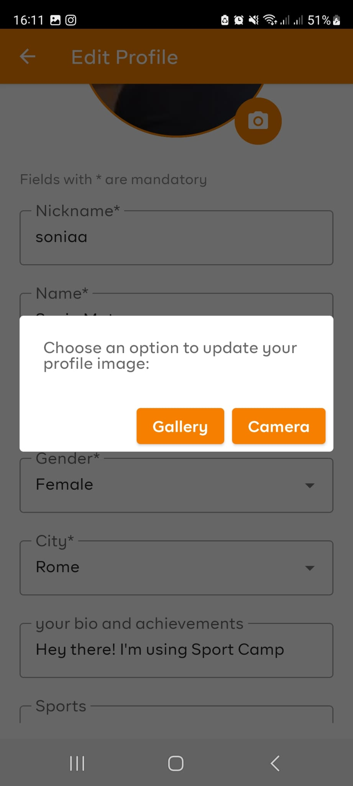

